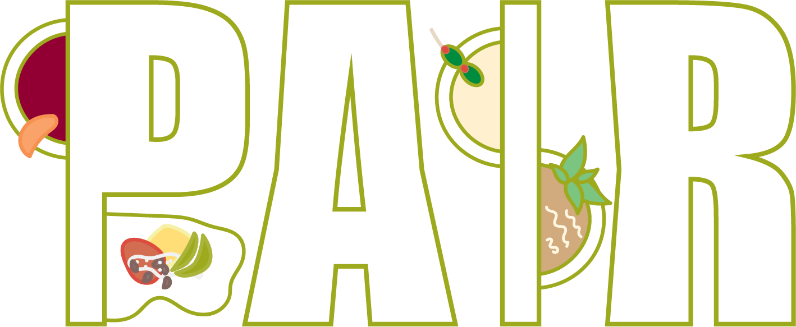
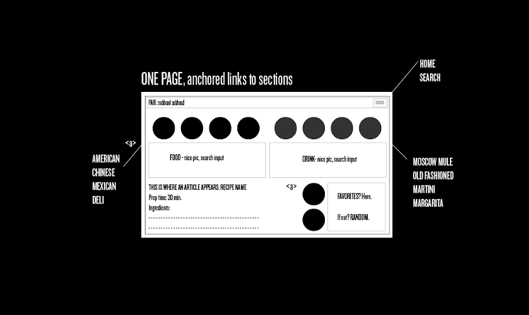
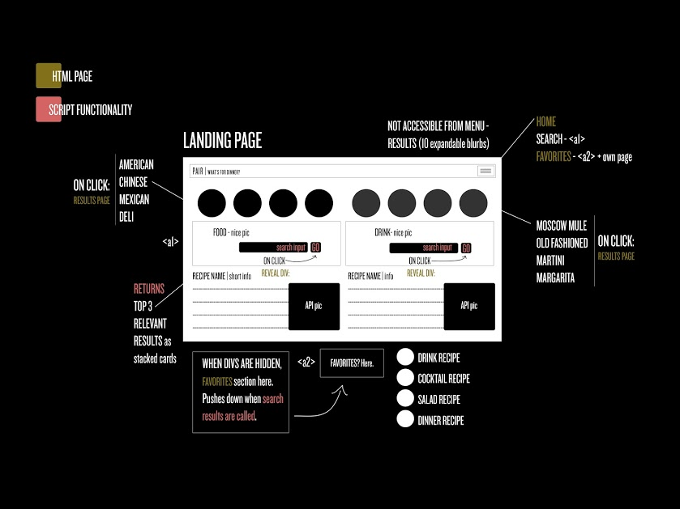
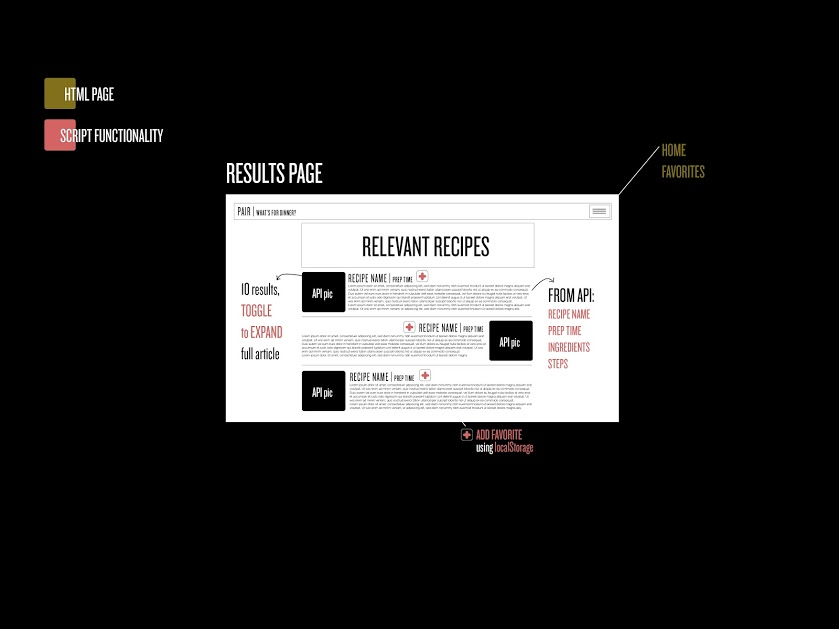
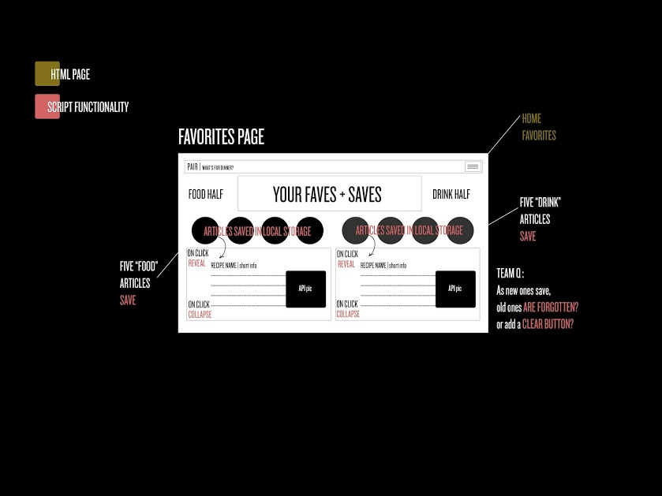

# Your Launching Pad for At-Home Culinary Curation

### Pair is a dynamic and mobile-responsive web application that lets a user search for food and cocktail recipes from separata databases and curate the results in one place. Pair is an essential tool for anyone looking for inspiration in the kitchen or behind the bar.

### Link to Deployed Project:
* https://brandyquinlan.github.io/Project1/

---
## Method and Approach

This project was a collaborative effort between the listed contributors. Using Agile software development techniques and version control, we adapted to changes in our end product by always aiming to choose the most lightweight, user-friendly option.

One of the most important parts of a collaborative project is setting, following and regularly comparing against a User Story and Acceptance Criteria. Pair's build criteria is listed as follows:


### User Story
<<<<<<< HEAD

> AS AN authenticated user  
> I WANT to use an app to locate food and drink recipes  
> SO THAT I can do meal planning  


## Aceptance Criteria

> As an authenticated user...  
> WHEN I log into the app  
>    THEN I can explore food or drink recipes  
>     
> WHEN I am looking for a specific dish   
>    THEN I can use a search box to pull recipes related to my search terms   
> WHEN I am looking for new meal ideas   
>    THEN I can use a filter dropdown to select from a list cuisines   
> WHEN I select a cuisine  
>    THEN I can see an image and short descriptions for 10 different results for that cuisine  
> WHEN I select a specific dish  
>    THEN I see a the ingredients, prep-time estimate, and instructions  
> WHEN I find a recipe that I want to use again  
>    THEN I can save that recipe in the app   
>    
> WHEN I am looking for a specific drink   
>    THEN I can use a search box to pull recipes related to my search terms  
> WHEN I am looking for new drink ideas  
>    THEN I can use a filter dropdown to select from drink categories  
> WHEN I select a category  
>    THEN I can see an image and short descriptions for 10 different results for that drink category  
> WHEN I select a specific drink  
>    THEN I see a the ingredients, prep-time estimate, and instructions  
> WHEN I find a recipe that I want to use again  
>    THEN I can save that recipe in the app  

=======
```
AS AN authenticated user
I WANT to use an app to locate food and drink recipes
SO THAT I can do meal planning
```

### Aceptance Criteria
```
As an authenticated user...
WHEN I log into the app
    THEN I can explore food or drink recipes

WHEN I am looking for a specific dish
    THEN I can use a search box to pull recipes related to my search terms
WHEN I am looking for new meal ideas
    THEN I can use a filter dropdown to select from a list cuisines
WHEN I select a cuisine
    THEN I can see an image and short descriptions for 10 different results for that cuisine
WHEN I select a specific dish
    THEN I see a the ingredients, prep-time estimate, and instructions
WHEN I find a recipe that I want to use again
    THEN I can save that recipe in the app

WHEN I am looking for a specific drink
    THEN I can use a search box to pull recipes related to my search terms
WHEN I am looking for new drink ideas
    THEN I can use a filter dropdown to select from drink categories
WHEN I select a category
    THEN I can see an image and short descriptions for 10 different results for that drink category
WHEN I select a specific drink
    THEN I see a the ingredients, prep-time estimate, and instructions
WHEN I find a recipe that I want to use again
    THEN I can save that recipe in the app
```
>>>>>>> f88b1159c7197e36d0c095073bf75e3d0152b662

### Wireframe Examples: Early Creative Processing



Creating a wireframe to mock up UI design for the initial build helps nail down the main components and functionality a project requires. We start with Version 1, a simple concept of a single page. In our following development sessions we decided to build out secondary pages for generated results and saved "favorites." The Version 2 wireframes below demonstrate these changes. 



Results Page Concept            |  Favorites Page Concept
:-------------------------:|:-------------------------:
  |  

---
## Usage and Functionality

(insert screenshots and walk-through of final product)

---
## Contributors


> Steve Babb  
> Keaton Brewster  
> Kat Buchanan  
> Brandy Quinlan  


---
## Credits


### :sparkles: [Materialize CSS](https://materializecss.com/)
### :fork_and_knife: [Spoonacular API](https://spoonacular.com/)
### :tropical_drink: [The Cocktail DB API](https://www.thecocktaildb.com/)
### :blue_book: [Google Fonts](https://code.jquery.com/)
### :globe_with_meridians: [jQuery CDN](https://fonts.google.com/)
